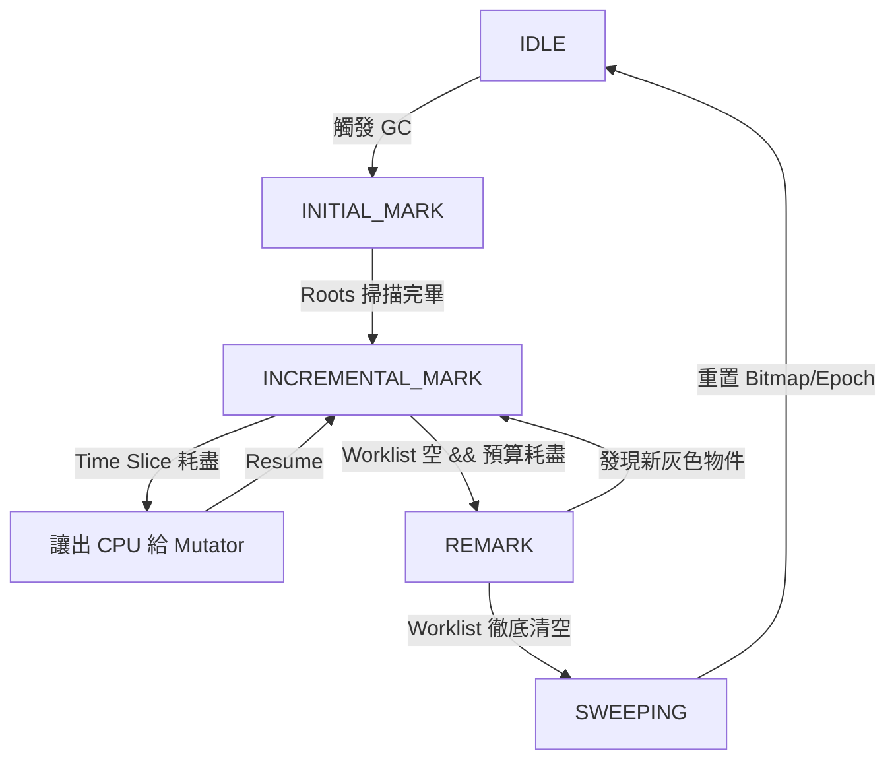

這是一份基於我們深入討論後修正的 **rudo-gc 增量收集器技術規格書 (v2.0)**。

這份文件修正了 v1.0 中關於根掃描的安全性漏洞，並整合了「混合式清除 (Hybrid Sweep)」與「Dijkstra 寫入屏障」的最佳實踐。

---

# rudo-gc 增量收集器 (Incremental GC) 技術規格書

> **版本**：v2.0 (修正版)
> **日期**：2026-01-29
> **狀態**：Approved for Implementation
> **架構基礎**：BiBOP + TLAB + Mark-Sweep
> **核心變更**：STW $\to$ Incremental (Dijkstra Barrier + Hybrid Sweep)

---

## 1. 核心設計理念

為了將 GC 暫停時間控制在 **< 5ms** (99.9% tail latency)，本設計採用 **增量標記 (Incremental Marking)** 搭配 **延遲清除 (Lazy Sweeping)**。

### 關鍵決策
1.  **三色標記 (Tri-color Marking)**：引入灰色狀態，允許標記過程被中斷。
2.  **Dijkstra 寫入屏障 (Insertion Barrier)**：確保強三色不變性 (Strong Tri-color Invariant)，防止黑色物件指向白色物件。
3.  **原子根掃描 (Atomic Root Scanning)**：為了安全性，根集合掃描保持 STW，不進行增量切分。
4.  **混合式清除 (Hybrid Sweep)**：
    *   **無 Drop 物件**：極致延遲回收 (Lazy Reclaim)，O(1) 位元運算。
    *   **有 Drop 物件**：背景執行緒並行解構 (Background Finalization)。

---

## 2. 系統狀態機 (State Machine)

GC 週期不再是一個單一函數，而是一個可被調度的狀態機。

### 2.1 階段定義

| 階段 ID | 名稱 | 類型 | 描述 |
| :--- | :--- | :--- | :--- |
| `0` | **IDLE** | - | 等待觸發條件 (Allocation pressure / Explicit call)。 |
| `1` | **INITIAL_MARK** | **STW** | 暫停所有執行緒，掃描 Roots (Stack, Global)，將直接引用的物件推入 Worklist (變灰)。 |
| `2` | **INCREMENTAL_MARK** | Concurrent | Mutator 與 GC 交替執行。GC 處理 Worklist；Mutator 透過 Barrier 產生新灰色物件。 |
| `3` | **REMARK** | **STW** | 暫停，處理剩餘的 Worklist (包含 Barrier 產生的)，確保標記完全結束。 |
| `4` | **SWEEPING** | Concurrent | 邏輯上 GC 結束。啟用 Lazy Sweep 與 Background Drop。 |

### 2.2 狀態轉換圖



---

## 3. 寫入屏障 (Write Barrier)

為了維護三色不變性，必須攔截所有對堆積物件的指標修改。

### 3.1 屏障演算法：Dijkstra (Insertion)

當 Mutator 執行 `slot = new_value` 時：

```rust
// 虛擬碼邏輯
fn write_barrier<T>(slot: &mut Gc<T>, new_value: Gc<T>) {
    // 1. 快速路徑：如果不在標記階段，直接返回
    if !global_heap.is_marking() {
        *slot = new_value;
        return;
    }

    // 2. 慢速路徑：將新引用的物件塗灰 (Shade Grey)
    // 無論來源物件是黑是白，只要確保 new_value 被標記即可保證安全
    unsafe {
        global_heap.mark_queue.push(new_value.ptr);
    }
    
    // 3. 執行寫入
    *slot = new_value;
}
```

### 3.2 API 變更 (`rudo-gc/src/ptr.rs`)

由於 Rust 無法攔截原生指標寫入，必須引入 `GcCell` 或透過 `GcBox` 內部實作保護所有指標修改。

**重要限制**：用戶程式碼必須使用 `GcCell<T>` 來包裹需要修改的可追蹤物件。如果直接操作 `UnsafeCell<T>` 或原始指標，寫入屏障將不會觸發，導致三色不變性被破壞。

```rust
pub struct GcCell<T: Trace> {
    inner: UnsafeCell<T>,
}

impl<T: Trace> GcCell<T> {
    pub fn set(&self, val: T) {
        // 觸發 Barrier
        if let Some(traceable) = val.as_traceable() {
             barrier::write_barrier(traceable);
        }
        unsafe { *self.inner.get() = val; }
    }
}
```

**內部資料結構更新**：所有 `rudo-gc` 內部容器（如 `GcVec`、`GcHashMap`）必須在底層使用 `GcCell` 或同等機制，確保對堆積指標的任何修改都會經過屏障。

---

## 4. 記憶體分配與回收 (Allocation & Reclamation)

### 4.1 分配顏色 (Allocation Color)

在 `INCREMENTAL_MARK` 階段分配的新物件，必須視為 **存活 (Black)**。

*   **實作**：TLAB 分配時，直接將對應的 `mark_bitmap` bit 設為 1。
*   **理由**：防止新分配的物件因為未被掃描到而被誤認為垃圾回收。

### 4.2 混合式清除策略 (Hybrid Sweep)

針對 `Drop` 的有無，採取分流處理。

#### A. 無 Drop 頁面 (Fast Path)
*   **判斷**：`!PageHeader.has_drop`
*   **時機**：Mutator 請求 TLAB Refill 時。
*   **邏輯**：
    ```rust
    // O(1) 重用
    let survivors = page.mark_bitmap.load();
    page.allocated_bitmap = survivors; // 活下來的 = 已分配的
    page.mark_bitmap.store(0);         // 清空標記給下一輪
    // 剩餘的 0 就是空閒 slots
    ```

#### B. 有 Drop 頁面 (Safe Path)
*   **判斷**：`PageHeader.has_drop`
*   **時機**：
    1.  **背景**：`BackgroundFinalizer` 執行緒主動掃描。
    2.  **前景**：記憶體不足時，Mutator 同步掃描。
*   **邏輯**：
    1.  計算 `dead_mask = allocated & (!marked)`。
    2.  遍歷 `dead_mask`，對每個 slot 呼叫 `drop_in_place`。
    3.  標記頁面為 `CLEAN`。
    4.  歸還給 Free List 供 TLAB 重用。

---

## 5. 資料結構定義

### 5.1 全域控制區塊

```rust
pub struct IncrementalState {
    pub phase: AtomicU8,           // IDLE, MARK, SWEEP...
    pub mark_queue: GlobalWorkQueue, // 灰色物件池
    pub pending_drop_pages: SegQueue<PageID>, // 待 Drop 的頁面
}

// 階段常數
const PHASE_IDLE: u8 = 0;
const PHASE_INITIAL_MARK: u8 = 1;
const PHASE_INCREMENTAL_MARK: u8 = 2;
const PHASE_REMARK: u8 = 3;
const PHASE_SWEEPING: u8 = 4;
```

### 5.2 頁面標頭擴充

```rust
pub struct PageHeader {
    // 現有欄位...
    pub mark_bitmap: AtomicU64,
    pub allocated_bitmap: AtomicU64,
    
    // 新增欄位
    pub has_drop: bool,      // 該頁面物件是否需要 Drop (建立時決定)
    pub is_clean: AtomicBool,// 是否已完成 Drop 處理
}
```

---

## 6. 實作階段規劃 (Implementation Roadmap)

### Phase 1: 基礎設施重構 (Infrastructure)
*   **目標**：將 `collect()` 拆解為狀態機，但暫時仍以 STW 方式執行所有步驟。
*   **工作**：
    1.  定義 `IncrementalState`。
    2.  將 `collect()` 拆分為 `initial_mark()`, `mark_loop()`, `sweep()`。
    3.  驗證拆分後的 GC 正確性（此時 Pause Time 仍長）。

### Phase 2: 寫入屏障與 API (The Barrier)
*   **目標**：引入 `GcCell` 並實作 Dijkstra Barrier。
*   **工作**：
    1.  實作 `GcCell<T>`。
    2.  實作 `write_barrier` 函數（將物件推入 `mark_queue`）。
    3.  **關鍵**：修改所有內部資料結構（如 `GcVec`）使用 `GcCell` 內部保護指標修改。
    4.  **文件**：明確標註 `GcCell` 為 Barrier 生效的必要條件。

### Phase 3: 啟用增量標記 (Incremental Marking)
*   **目標**：縮短 Pause Time。
*   **工作**：
    1.  修改 `allocator`：在標記階段分配黑色物件 (Allocate Black)。
    2.  實作 `step(budget)`：允許標記迴圈執行 N 個單位後暫停。
    3.  將 `INCREMENTAL_MARK` 階段改為與 Mutator 交替執行。
    4.  實作 `REMARK` 階段的 STW 邏輯。

### Phase 4: 混合式清除 (Hybrid Sweep)
*   **目標**：優化清除效能與 Cache Locality。
*   **工作**：
    1.  在 `PageHeader` 加入 `has_drop` 標記。
    2.  實作 `BackgroundFinalizer` 執行緒。
    3.  修改 `LocalHeap::refill_tlab` 支援 Lazy Reclaim。

---

## 7. 安全性驗證清單

1. **Use-After-Free**:
    *   [ ] 驗證 Barrier 是否正確攔截所有指標寫入。
    *   [ ] 驗證 Stack Scanning 是否在 STW 下完成（防止 Stack 變動漏標）。
    *   [ ] 驗證所有內部容器 (`GcVec`, `GcHashMap`) 是否使用 `GcCell` 或同等機制。
2. **Resource Leak**:
    *   [ ] 驗證 `has_drop` 頁面是否最終都會被 Finalizer 處理。
    *   [ ] 驗證 Mutator 在記憶體不足時是否會主動協助 Drop。
3. **Data Race**:
    *   [ ] 驗證 Bitmap 的原子操作順序 (Ordering)。
    *   [ ] 驗證 TLAB Refill 與 Background Sweeper 對同一頁面的競爭處理。

---

## 8. 已知限制

1. **GcCell 強制使用**：Rust 無法攔截原始指標寫入。用戶必須使用 `GcCell<T>` 包裹可修改的可追蹤物件，否則 Barrier 不會生效。
2. **外部指標**：從 C/CFFI 傳入的指標不會經過 Barrier，需確保這些指標在根掃描階段已被正確掃描。

---

## 8. 效能預估

| 指標 | 舊版 (STW) | 新版 (Incremental) | 備註 |
| :--- | :--- | :--- | :--- |
| **Max Pause Time** | O(Heap Size) | **O(Stack Size + Remark)** | 預期 < 5ms |
| **Throughput** | 高 | 中高 | Barrier 帶來約 5-10% 開銷 |
| **Allocation Speed** | 快 | 快 | Lazy Sweep 保持 TLAB 填充速度 |
| **Memory Overhead** | 低 | 低 | 僅增加少量 Metadata |

---

此規格書為 `rudo-gc` 下一階段開發的權威依據。