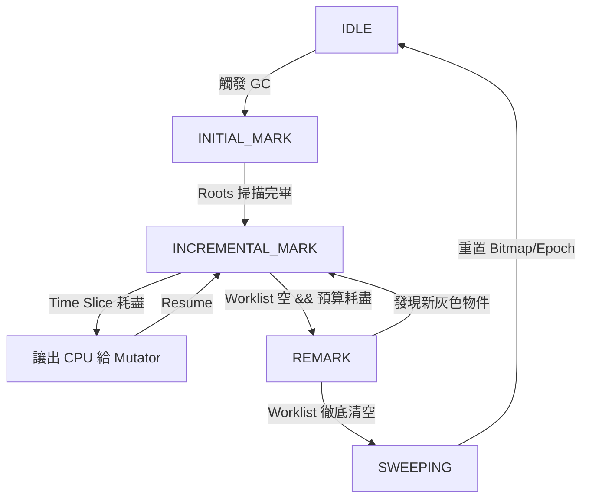

# rudo-gc 增量收集器技術規格書

> **版本**：v3.0
> **日期**：2026-01-29
> **狀態**：Approved for Implementation
> **架構基礎**：BiBOP + TLAB + Mark-Sweep
> **核心變更**：STW → Incremental (Dijkstra Barrier + Hybrid Sweep + Atomic Roots)

---

## 1. 設計目標

| 目標 | 說明 |
|------|------|
| **正確性優先** | 不遺漏標記、不釋放仍在使用的記憶體 |
| **暫停時間限制** | 99.9% 的 GC 暫停不超過 5ms |
| **漸進式實作** | 分階段交付，每階段可獨立運作 |
| **向後相容** | 現有 API 和行為保持不變 |

### 非目標

- 併發標記（暫時不實現）
- 移動式收集
- 硬即時保證

---

## 2. 核心設計理念

為了將 GC 暫停時間控制在 **< 5ms**，本設計採用 **增量標記 (Incremental Marking)** 搭配 **延遲清除 (Lazy Sweeping)**。

### 關鍵決策

1. **三色標記 (Tri-color Marking)**：引入灰色狀態，允許標記過程被中斷。
2. **Dijkstra 寫入屏障 (Insertion Barrier)**：確保強三色不變性，防止黑色物件指向白色物件。
3. **原子根掃描 (Atomic Root Scanning)**：根集合掃描保持 STW，不進行增量切分。
4. **混合式清除 (Hybrid Sweep)**：
   - **無 Drop 物件**：極致延遲回收 (Lazy Reclaim)，O(1) 位元運算。
   - **有 Drop 物件**：背景執行緒並行解構 (Background Finalization)。

---

## 3. 系統狀態機

GC 週期是一個可被調度的狀態機。

### 3.1 階段定義

| 階段 ID | 名稱 | 類型 | 描述 |
| :--- | :--- | :--- | :--- |
| `0` | **IDLE** | - | 等待觸發條件 (Allocation pressure / Explicit call)。 |
| `1` | **INITIAL_MARK** | **STW** | 暫停所有執行緒，掃描 Roots (Stack, Global)，將直接引用的物件推入 Worklist (變灰)。 |
| `2` | **INCREMENTAL_MARK** | Concurrent | Mutator 與 GC 交替執行。GC 處理 Worklist；Mutator 透過 Barrier 產生新灰色物件。 |
| `3` | **REMARK** | **STW** | 暫停，處理剩餘的 Worklist (包含 Barrier 產生的)，確保標記完全結束。 |
| `4` | **SWEEPING** | Concurrent | 邏輯上 GC 結束。啟用 Lazy Sweep 與 Background Drop。 |

### 3.2 狀態轉換圖



---

## 4. 資料結構定義

### 4.1 全域控制區塊

```rust
pub struct IncrementalState {
    pub phase: AtomicU8,
    pub mark_queue: GlobalWorkQueue,
    pub pending_drop_pages: SegQueue<PageID>,
}

const PHASE_IDLE: u8 = 0;
const PHASE_INITIAL_MARK: u8 = 1;
const PHASE_INCREMENTAL_MARK: u8 = 2;
const PHASE_REMARK: u8 = 3;
const PHASE_SWEEPING: u8 = 4;
```

### 4.2 增量狀態擴充欄位

```rust
pub struct IncrementalMarkState {
    pub is_incremental: AtomicBool,
    pub phase: AtomicU8,
    pub marked_bytes: AtomicUsize,
    pub total_bytes_to_mark: AtomicUsize,
    pub work_units_completed: AtomicUsize,
    pub total_work_units: AtomicUsize,
    pub slice_budget_ms: AtomicU64,
    pub last_slice_duration_ms: AtomicU64,
    pub collection_start_ns: AtomicU64,
    pub collection_id: AtomicU64,
}

const WORK_UNIT_SIZE: usize = 64 * 1024;
const DEFAULT_SLICE_BUDGET_MS: u64 = 5;
```

### 4.3 頁面標頭擴充

```rust
pub struct PageHeader {
    pub mark_bitmap: AtomicU64,
    pub allocated_bitmap: AtomicU64,
    pub has_drop: bool,
    pub is_clean: AtomicBool,
}
```

### 4.4 清除任務結構

```rust
pub struct PendingDrop {
    pub page: PageID,
    pub index: usize,
    pub ptr: NonNull<u8>,
    pub size: usize,
}

pub struct IncrementalSweeper {
    pub state: &IncrementalState,
    pub pending_finalize: SegQueue<PendingDrop>,
    pub pending_reclaim: SegQueue<PendingDrop>,
    pub current_page: AtomicU32,
}
```

---

## 5. 寫入屏障

### 5.1 屏障演算法：Dijkstra (Insertion)

當 Mutator 執行 `slot = new_value` 時：

```rust
fn write_barrier<T>(slot: &mut Gc<T>, new_value: Gc<T>) {
    if !global_heap.is_marking() {
        *slot = new_value;
        return;
    }
    unsafe {
        global_heap.mark_queue.push(new_value.ptr);
    }
    *slot = new_value;
}
```

### 5.2 GcCell API

```rust
pub struct GcCell<T: Trace> {
    inner: UnsafeCell<T>,
}

impl<T: Trace> GcCell<T> {
    pub fn set(&self, val: T) {
        if let Some(traceable) = val.as_traceable() {
             barrier::write_barrier(traceable);
        }
        unsafe { *self.inner.get() = val; }
    }
}
```

**重要**：Rust 無法攔截原始指標寫入。用戶必須使用 `GcCell<T>` 包裹可修改的可追蹤物件。

### 5.3 頁面級髒追蹤（保留供未來擴展）

```rust
impl PageHeader {
    pub fn is_dirty(&self, index: usize) -> bool;
    pub fn set_dirty(&self, index: usize);
    pub fn clear_all_dirty(&self);
}
```

---

## 6. 記憶體分配與回收

### 6.1 分配顏色

在 `INCREMENTAL_MARK` 階段分配的新物件，必須視為 **存活 (Black)**。

- **實作**：TLAB 分配時，直接將對應的 `mark_bitmap` bit 設為 1。
- **理由**：防止新分配的物件因為未被掃描到而被誤認為垃圾回收。

### 6.2 混合式清除策略

#### A. 無 Drop 頁面 (Fast Path)

```rust
fn refill_tlab_with_lazy_sweep(&mut self) {
    let survivors = page.mark_bitmap.load();
    page.allocated_bitmap = survivors;
    page.mark_bitmap.store(0);
}
```

#### B. 有 Drop 頁面 (Safe Path)

```rust
fn sweep_page_with_drop(page: &PageHeader) {
    let dead_mask = page.allocated_bitmap & !page.mark_bitmap;
    let mut index = 0;
    while let Some(bit) = dead_mask.lowest_bit() {
        let obj_ptr = page.get_object_at(index);
        drop_in_place(obj_ptr);
        dead_mask.clear_lowest_bit();
        index += 1;
    }
    page.allocated_bitmap = page.mark_bitmap.load();
    page.is_clean.store(true);
}
```

---

## 7. 增量標記流程

### 7.1 mark_slice 函數

```rust
pub fn mark_slice(&self, budget: Duration) -> usize {
    let start = Instant::now();
    let mut marked = 0;

    while start.elapsed() < budget {
        if let Some(ptr) = self.local_queue.pop() {
            marked += self.mark_object(ptr);
            continue;
        }
        for _ in 0..16 {
            if let Some(ptr) = self.steal_queue() {
                marked += self.mark_object(ptr);
                break;
            }
        }
        break;
    }
    marked
}
```

### 7.2 mark_object 函數

```rust
fn mark_object(&self, ptr: GcPtr) -> usize {
    let page = ptr.page();
    let index = ptr.index();
    if !page.try_set_mark_bit(index) {
        return 0;
    }
    let size = ptr.size();
    for child in ptr.children() {
        self.mark_object(child);
    }
    size
}
```

---

## 8. 漸進式根掃描

### 8.1 IncrementalRootScanner

```rust
pub struct IncrementalRootScanner {
    pub state: &IncrementalState,
    pub collected_roots: Vec<GcPtr>,
    pub thread_scan_progress: Vec<usize>,
    pub total_threads: usize,
}

impl IncrementalRootScanner {
    pub fn scan_thread_slice(&self, thread_id: usize, budget: Duration) {
        let stack = self.get_thread_stack(thread_id);
        let start = stack.bottom();
        let end = stack.top();
        let mut offset = self.thread_scan_progress[thread_id];
        let max_scan = budget.as_nanos() as usize / NANOS_PER_POINTER;

        while offset < (end - start) && offset < max_scan {
            let ptr = unsafe { *(start.add(offset)) };
            if self.is_gc_ptr(ptr) {
                self.collected_roots.push(ptr);
            }
            offset += POINTER_SIZE;
        }
        self.thread_scan_progress[thread_id] = offset;
    }
}
```

**注意**：根掃描在 `INITIAL_MARK` 階段以 STW 方式原子執行，不進行增量切分。

---

## 9. API 擴展

### 9.1 配置選項

```rust
pub struct IncrementalConfig {
    pub enabled: bool,
    pub slice_budget_ms: u64,
    pub max_incremental_heap_bytes: usize,
    pub max_incremental_work_units: usize,
}

impl GcConfig {
    pub fn set_incremental_config(&mut self, config: IncrementalConfig);
    pub fn incremental_config(&self) -> IncrementalConfig;
}
```

### 9.2 Gc<T> 擴充方法

```rust
impl<T> Gc<T> {
    pub fn is_marked(&self) -> bool;
    pub fn is_from_page_with_drop(&self) -> bool;
}
```

---

## 10. 模組結構

```
src/gc/
├── incremental/
│   ├── mod.rs
│   ├── state.rs
│   ├── scheduler.rs
│   ├── barrier.rs
│   ├── marking.rs
│   ├── sweeping.rs
│   └── roots.rs
```

---

## 11. 效能特性

### 11.1 暫停時間保證

| 操作 | 最壞情況 |
|------|----------|
| 安全點檢查 | < 0.1ms |
| 寫入屏障 | < 10ns |
| 標記切片 | <= 5ms |
| 清除切片 | <= 5ms |
| INITIAL_MARK + REMARK | O(Stack Size) |

### 11.2 記憶體開銷

| 元件 | 開銷 |
|------|------|
| IncrementalState | ~100 位元組 |
| IncrementalMarkState | ~200 位元組 |
| PageHeader 擴充 | +16 位元組 |
| 寫入屏障 | 每物件寫入 +1 原子操作 |

### 11.3 吞吐量預估

| 指標 | STW | Incremental | 備註 |
|------|-----|-------------|------|
| Max Pause Time | O(Heap Size) | O(Stack Size + Remark) | 預期 < 5ms |
| Throughput | 高 | 中高 | Barrier 帶來約 5-10% 開銷 |
| Allocation Speed | 快 | 快 | Lazy Sweep 保持 TLAB 填充速度 |
| Memory Overhead | 低 | 低 | 僅增加少量 Metadata |

---

## 12. 實作階段規劃

### Phase 1: 基礎設施重構

- [ ] 定義 `IncrementalState` 和 `IncrementalMarkState`
- [ ] 將 `collect()` 拆分為狀態機函數
- [ ] 驗證拆分後的 GC 正確性

### Phase 2: 寫入屏障與 GcCell

- [ ] 實作 `GcCell<T>`
- [ ] 實作 `write_barrier` 函數
- [ ] 修改內部容器使用 `GcCell` 保護指標修改
- [ ] 新增單元測試

### Phase 3: 增量標記

- [ ] 實作 `mark_slice` 和 `mark_object`
- [ ] 修改 allocator 在標記階段分配黑色物件
- [ ] 實作 `REMARK` 階段的 STW 邏輯

### Phase 4: 混合式清除

- [ ] 在 `PageHeader` 加入 `has_drop` 標記
- [ ] 實作 `BackgroundFinalizer` 執行緒
- [ ] 修改 `LocalHeap::refill_tlab` 支援 Lazy Reclaim

### Phase 5: API 與配置

- [ ] 新增 `IncrementalConfig` 結構
- [ ] 擴展 `GcConfig` API
- [ ] 更新文件

---

## 13. 測試策略

### 13.1 測試類型

- **單元測試**：狀態轉換、切片執行、屏障邏輯
- **整合測試**：無記憶體洩漏、最大暫停時間
- **並列測試**：多執行緒同時分配、 Barrier 競爭
- **Miri 測試**：記憶體安全驗證

### 13.2 正確性驗證

1. **三色不變性**：使用 Dijkstra Barrier 確保強三色不變性
2. **標記完整性**：REMARK 階段確保所有新灰色物件被處理
3. **回收正確性**：無 Drop 頁面正確重用，有 Drop 頁面正確解構

---

## 14. 安全性驗證清單

1. **Use-After-Free**:
   - [ ] 驗證 Barrier 是否正確攔截所有指標寫入
   - [ ] 驗證 Stack Scanning 是否在 STW 下完成
   - [ ] 驗證所有內部容器使用 `GcCell` 或同等機制

2. **Resource Leak**:
   - [ ] 驗證 `has_drop` 頁面是否最終都會被 Finalizer 處理
   - [ ] 驗證 Mutator 在記憶體不足時是否會主動協助 Drop

3. **Data Race**:
   - [ ] 驗證 Bitmap 的原子操作順序
   - [ ] 驗證 TLAB Refill 與 Background Sweeper 對同一頁面的競爭處理

---

## 15. 已知限制

1. **GcCell 強制使用**：Rust 無法攔截原始指標寫入。用戶必須使用 `GcCell<T>` 包裹可修改的可追蹤物件，否則 Barrier 不會生效。

2. **外部指標**：從 C/CFFI 傳入的指標不會經過 Barrier，需確保這些指標在根掃描階段已被正確掃描。

3. **最大暫停時間**：INITIAL_MARK 和 REMARK 階段與 Stack 大小成正比，在 Stack 極大的情況下可能超過 5ms。

---

## 16. 參考文獻

1. Jones, R., et al. (2012). "The Garbage Collection Handbook"
2. Dybvig, R. K. (2006). "Chez Scheme Version 8 User's Guide"
3. Hudson, R. L., et al. (1991). "Incremental Garbage Collection for Generational Collectors"
4. Appel, A. W. (1987). "Garbage Collection Can Be Faster Than Allocation"

---

文件版本：v3.0
日期：2026-01-29
